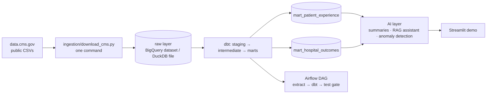

# HCAHPS Analytics Platform

A production-style, open-source data platform built on **public U.S. hospital data**.
It turns raw CMS (Centers for Medicare & Medicaid Services) files into trusted,
tested data products for patient experience and hospital outcomes — orchestrated,
AI-augmented, and fully reproducible for $0/month.

**Why this exists:** hospitals are surveyed on patient experience (HCAHPS), and those
public scores influence Medicare payments. Leaders need those numbers correct, fresh,
and explorable. This project shows how to build that pipeline the way a real data
engineering team would.

## Data sources (public domain, U.S. Government Open Data)

| Dataset | CMS ID | What it is |
|---|---|---|
| Patient survey (HCAHPS) - Hospital | `dgck-syfz` | Patient-experience survey scores by hospital and measure |
| Complications and Deaths - Hospital | `ynj2-r877` | 30-day mortality / complication rates vs. national benchmarks |

Raw files are downloaded untouched from `https://data.cms.gov/provider-data/` and
stored in `ingestion/raw/` so any number can always be traced back to its source.

## Architecture



## Quickstart

```bash
# 1. Clone and enter
git clone <repo-url>
cd hcahps-analytics-platform

# 2. Install (Python 3.10+)
python -m venv .venv && source .venv/bin/activate
pip install -r ingestion/requirements.txt

# 3. Run ingestion (downloads CMS data, loads DuckDB raw layer)
make ingest
```

To also load BigQuery: `make ingest-bigquery BQ_PROJECT=your-gcp-project`
(requires a GCP project + service-account key — see `ingestion/README.md`).

## Project structure

```
ingestion/        Raw-data download + load (M2)
infra/            Platform as code: datasets, service account, IAM, $1 budget (Terraform)
dbt/              Staging → intermediate → marts, tests, docs (M3)
dags/             Airflow orchestration with test gates (M4)
ai/               Narrative summaries, RAG assistant, anomaly detection (M5)
app/              Stakeholder demo app (M6)
docs/diagrams/    Architecture diagrams as code (Mermaid)
warehouse/        Local DuckDB file (git-ignored; built by `make ingest`)
```

## Cost

$0/month. Every tool is open-source or on a free tier — see the financial
pre-flight table in the M1 design doc. A GCP budget alert guards the $0 boundary.

## Milestones

M1 technical design → M2 ingestion → M3 dbt core → M4 orchestration → M5 AI layer
→ M6 stakeholder showcase. Each milestone is reviewed before the next begins.
